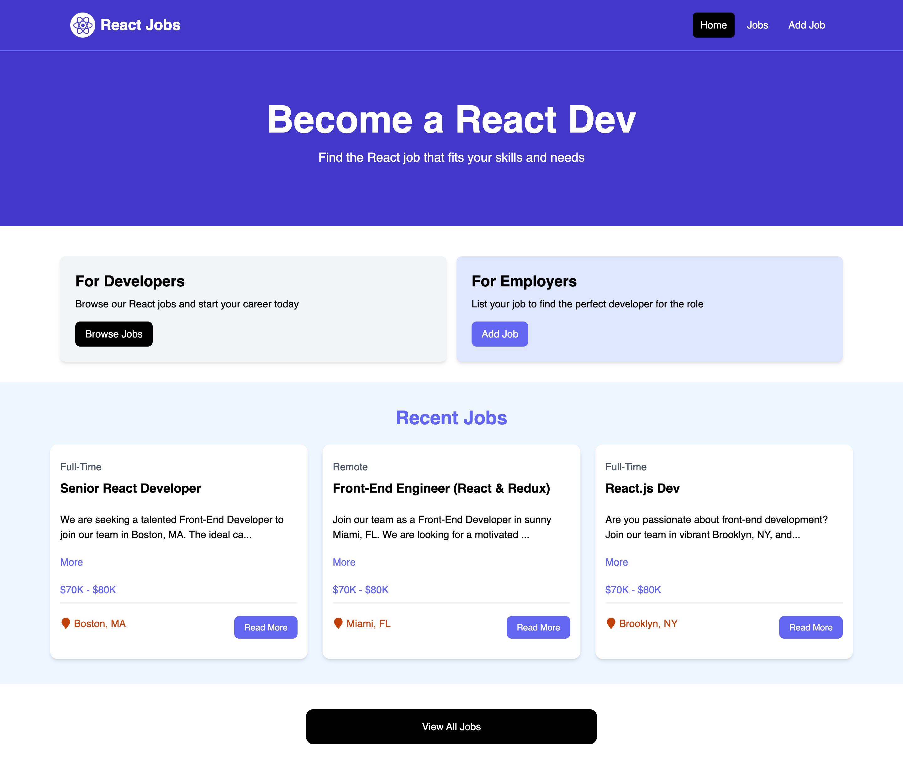
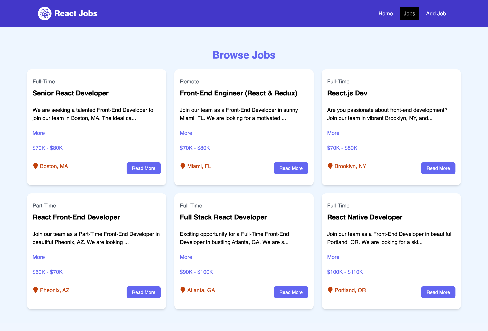
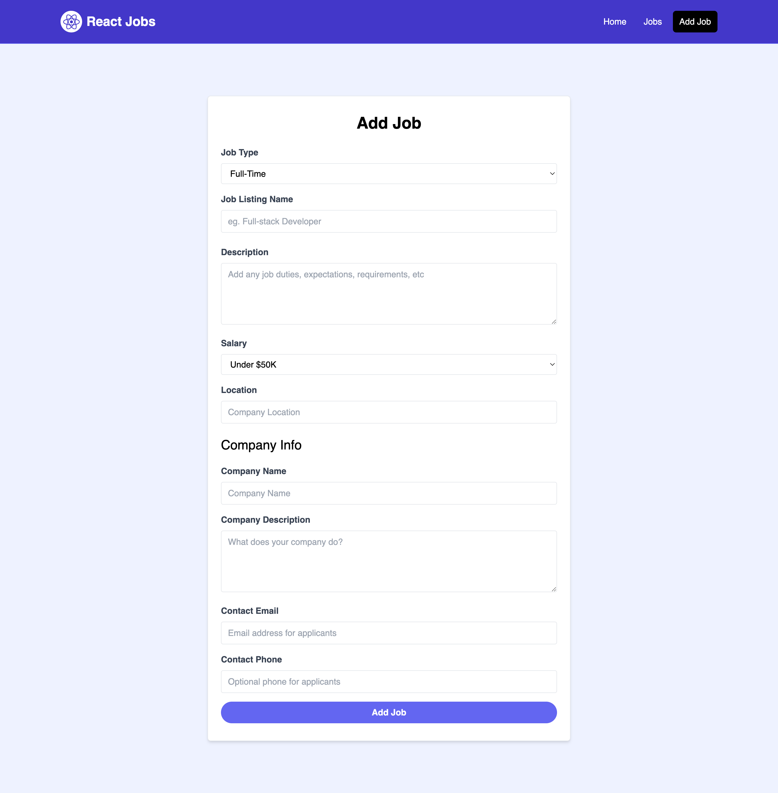
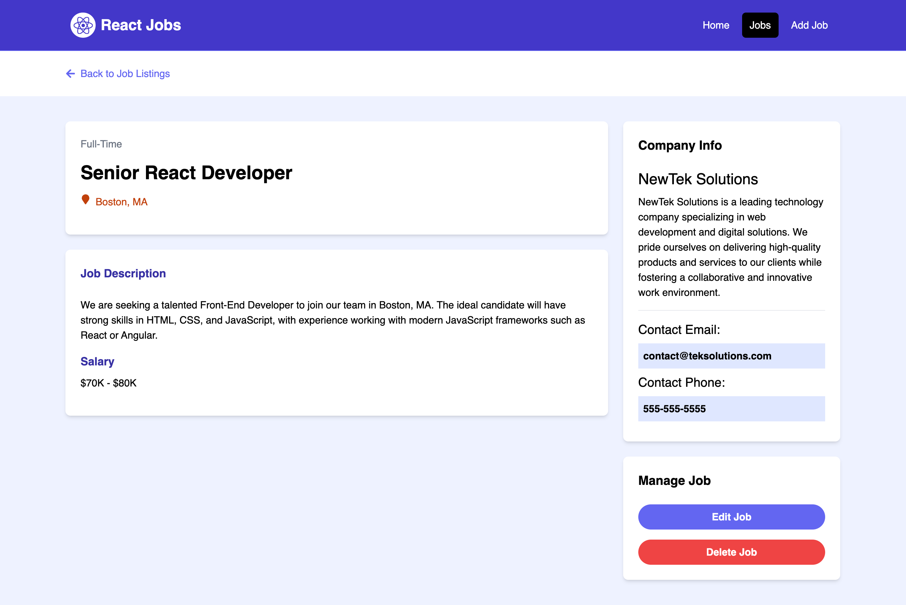

# React Jobs Project(React&Vite)

This is the jobs listing project developed using React.js. 



## Browse Jobs page



## Add Job page



## Single Job page



## Usage

This project uses JSON-Server for a mock backend.

### Install Dependencies

```bash
npm install
```

### Run JSON Server

The server will run on http://localhost:8888

```bash
npm run server
```

### Run Vite Frontend

React will run on http://localhost:8000

```bash
npm run dev
```

### Build for Production

```bash
npm run build
```

### Preview Production Build

```bash
npm run preview
```
